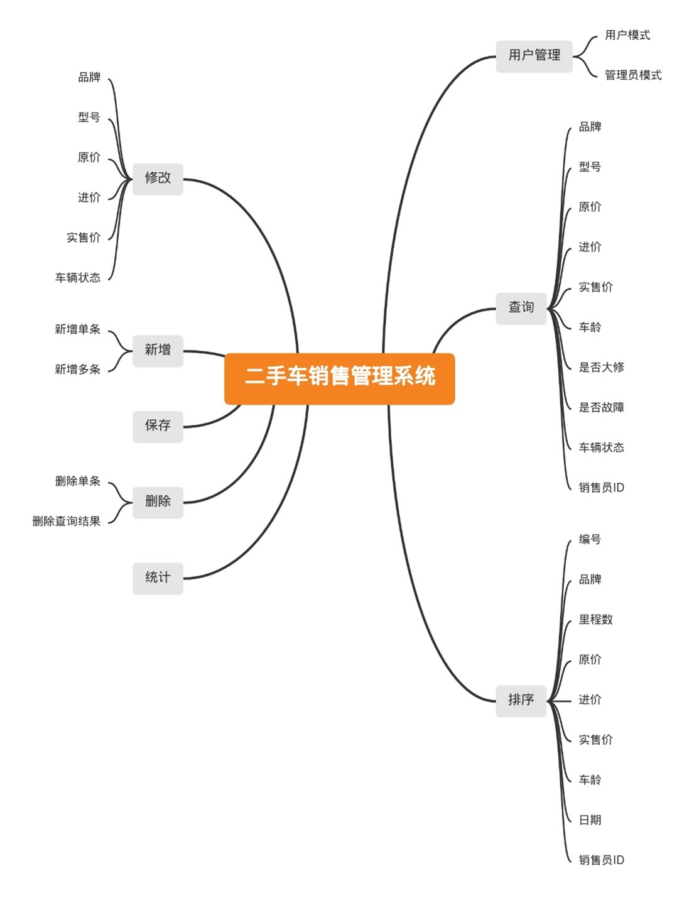
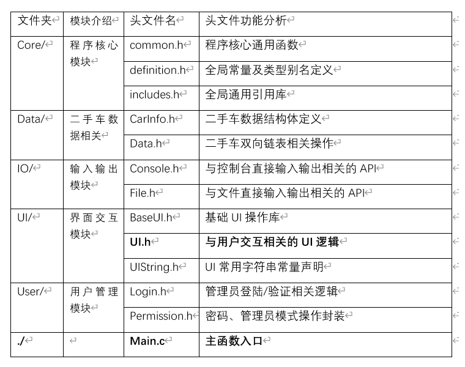
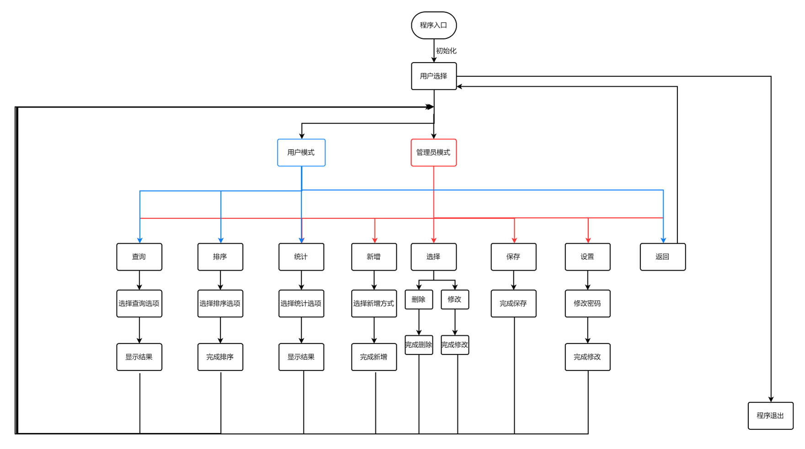

# 二手车销售管理系统

**By Hil**

## 简介

学校的大一C语言程序设计实验期末大作业。代码总耗时约为8h，未经过足够的测试、重构及优化，以完成任务为第一目标进行的代码编写。请谨慎阅读。

有机会也许会拿出来完善一下。

程序运行所需数据文件均在`./Example`内，请将其内容移动至可执行文件路径下`./data`内。

所使用演示数据大部分均为捏造，请勿过多深究。

## Tips

- 数据列表页面，除了使用[~N]跳转外，也可直接使用[+]、[-]进行上一页、下一页操作
- 数据输入验证过滤不足，酒吧炒饭.jpg警告

## 系统框架

## 模块分析

## 代码流程

